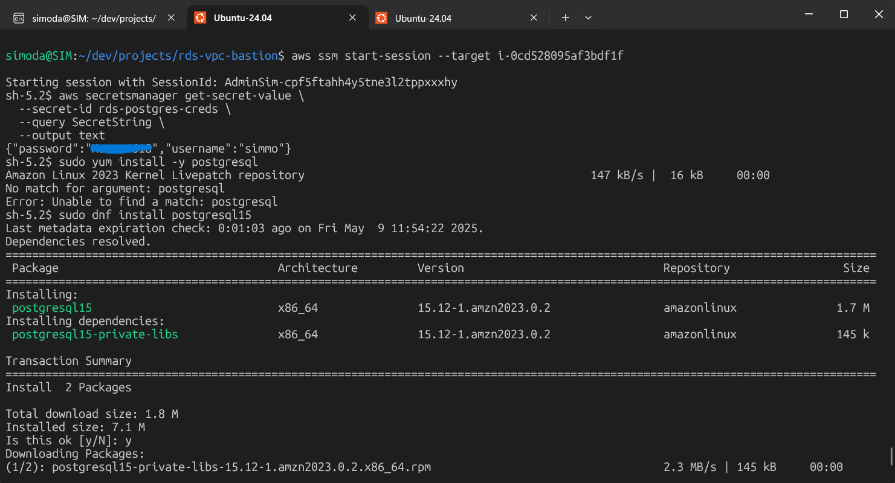

# PostgreSQL Cloud Migration via Bastion and Terraform

## Project Overview

This project demonstrates a secure, production-grade migration of a local PostgreSQL database into an Amazon RDS PostgreSQL instance. It uses a Bastion EC2 instance and AWS Systems Manager Session Manager for secure access, avoiding the use of SSH. The entire infrastructure is provisioned using Terraform. AWS Secrets Manager is used to handle credentials securely, and Amazon S3 is used to stage and transfer the SQL dump.

The goal of the project was to replicate real-world DevOps workflows, where infrastructure must be managed as code, services secured through IAM, and migrations performed cleanly with minimal manual intervention. This was incredibly satisfying, as I had struggled just last month with a SQL Server migration — how far I've come.

## Architecture and Stack

The infrastructure was provisioned using Terraform and included:

- A dedicated VPC with public and private subnets
- Internet Gateway and NAT Gateway
- A Bastion EC2 instance in a public subnet, configured for SSM access
- An RDS PostgreSQL instance in a private subnet
- AWS Secrets Manager for storing RDS credentials
- CloudWatch alarms for basic monitoring

SSM Session Manager was used for access to the EC2 instance instead of SSH, following best practice for secure remote administration. A local PostgreSQL database (Windows installation) was used as the source, and data was transferred via a `.sql` dump file uploaded to S3.

## Key DevOps Features Demonstrated

The project showcases several critical DevOps practices:

- Infrastructure as Code (IaC) using Terraform
- Secrets management with IAM and AWS Secrets Manager
- Use of SSM instead of traditional SSH for enhanced security
- Secure data transfer via S3 and command-line tooling
- Production-style VPC setup with public and private routing
- Real-world troubleshooting around encoding, role permissions, and cross-platform compatibility

## Migration Workflow

1. A local PostgreSQL database named `simmodb` was created in pgAdmin 4 with `companies` and `employees` tables.
2. A complete AWS environment was provisioned using Terraform, including networking, Bastion EC2 instance, RDS, and IAM roles.
3. Session Manager was used to securely connect to the Bastion host without exposing SSH.
4. A SQL dump of the local database was created using `pg_dump` on Windows.
5. The dump file was transferred to Ubuntu via WSL and uploaded to S3.
6. The file was downloaded from S3 to the Bastion EC2 instance using the AWS CLI.
7. The RDS database was populated using `psql` to import the dump file.

## Challenges and Resolutions

Several challenges were encountered and resolved during the project:

- PostgreSQL server was not running on Windows during the first dump attempt, resulting in a zero-byte file.
- Drag-and-drop file transfer into Ubuntu renamed and potentially corrupted the file. This was fixed by copying directly from the Windows filesystem using `/mnt/c/...`.
- The dump file included a BOM (byte-order mark) due to Windows encoding, which caused errors on import. It was resolved by converting the file with `iconv` to UTF-8.
- Role mismatch errors occurred because the dump referenced the `postgres` user, which did not exist in the RDS environment. These were harmless and ignored, but could be avoided in the future by using the `--no-owner` flag with `pg_dump`.

## Validation

The final step involved connecting to the RDS database via `psql` and verifying the data:

```sql
\dt
SELECT * FROM companies;
SELECT * FROM employees;
```

The output confirmed that the data was successfully migrated and accessible. PostgreSQL RDS Migration – Data Validation in Target DB (psql)

## Summary

This project represents a full lifecycle of secure database migration from on-premise to AWS. It integrates multiple AWS services and adheres to DevOps best practices including IaC, secure credential handling, and minimal manual intervention. It also involved hands-on troubleshooting and decision-making under real constraints, which reflects the kinds of challenges DevOps engineers face daily.

The final environment was then safely destroyed using `terraform destroy`, ensuring no ongoing costs.

## Next Steps

- Modularize the Terraform code
- Add CI/CD pipelines for infrastructure or database changes
- Integrate a frontend (e.g., Flask API or React app) connected to RDS
- Document the project fully in a GitHub repository with setup instructions

This project serves as a practical and demonstrable DevOps experience, suitable for inclusion in a portfolio or as a foundation for future infrastructure automation work.
